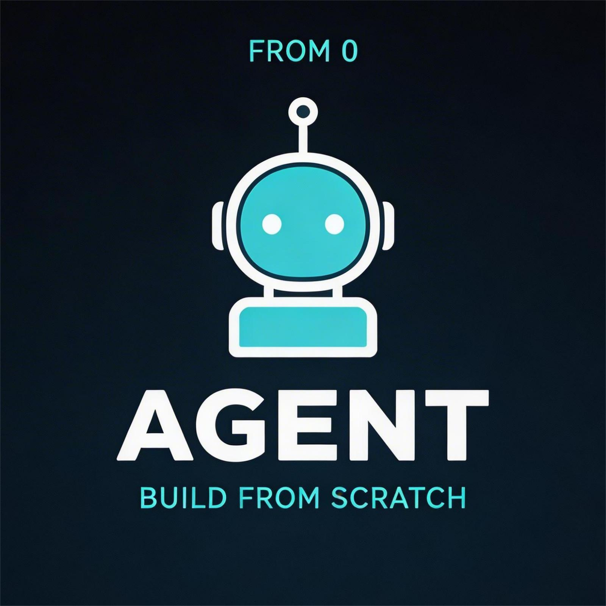

# AgentCraft - 从零构建你的第一个 AI 编程助手



---

## 项目简介

**AgentCraft** 是一个从零到一的 AI Agent 教学项目，手把手教你构建一个类似 Claude Code 的迷你版编程助手。

> 很多人用 Claude Code 或 Cursor 写代码，觉得这些 AI 编程助手很神奇。但如果你问一句"它到底是怎么工作的"，大部分人答不上来。

本项目通过 **13 节课**，每节课只加一个机制，每个机制都有可运行的 Python 代码。整个过程就像剥洋葱一样，一层一层地把 AI Agent 的核心原理展现在你面前。

---

## 为什么学习这个项目？

### 打破"黑盒"魔咒

如果你不懂原理，你就只能是个"用户"。当 AI Agent 的能力边界在哪里、为什么有时候会抽风、怎么优化它的表现——这些你都无从判断。

### 课程设计精妙

| 特点 | 说明 |
|------|------|
| **渐进式学习** | 13 节课，每节只加一个机制 |
| **可运行代码** | 每个知识点都有完整 Python 实现 |
| **核心原理** | 先讲问题，再讲方案，配图解 |
| **真实可用的 Agent** | 学完就能得到一个完整系统 |

### 实战导向

不是死记硬背代码，而是让你真正理解每个机制解决了什么问题、为什么要这么设计。

---

## 你能学到什么？

### 核心技术点

| 阶段 | 知识点 | 应用场景 |
|------|--------|----------|
| **核心循环** | Agent Loop、Tool Dispatch | 任何 Agent 的基础架构 |
| **规划能力** | TodoWrite、Nag Reminder | 让 Agent 有计划、不跑偏 |
| **任务拆分** | Subagent 隔离 | 处理复杂大任务 |
| **知识管理** | Skill 按需加载 | 避免上下文膨胀 |
| **上下文压缩** | 三层压缩策略 | 支持无限长会话 |
| **持久化** | File-based Tasks | 任务跨会话保存 |
| **后台执行** | Threading + Queue | 并行任务不阻塞 |
| **多 Agent** | Teams + Protocols | 团队协作 |
| **自治系统** | WORK/IDLE 状态机 | 自主任务认领 |
| **隔离执行** | Git Worktree | 并行任务互不干扰 |

### 完整工具链

学完后你将拥有一个包含 **24 个工具** 的完整 Agent：

```
基础工具:     bash | read_file | write_file | edit_file
规划工具:     TodoWrite
子任务:       task (spawn subagent)
知识:         load_skill
压缩:         compress
后台:         background_run | check_background
任务系统:     task_create | task_update | task_list | task_get
团队:         spawn_teammate | list_teammates | send_message
            read_inbox | broadcast
协议:         shutdown_request | plan_approval
自治:         idle | claim_task
```

---

## 课程大纲

### 第一阶段：核心循环 (s01-s02)

```
s01: Agent Loop        "One loop & Bash is all you need"
s02: Tool Use         "Adding a tool means adding one handler"
```

**入门起点**：一个 while 循环 + 工具调用，这就是所有 AI Agent 的核心。

### 第二阶段：规划与知识 (s03-s06)

```
s03: TodoWrite         "An agent without a plan drifts"
s04: Subagents         "Break big tasks down"
s05: Skills            "Load knowledge when you need it"
s06: Context Compact   "Context will fill up"
```

**进阶能力**：让 Agent 有计划、会拆分、懂加载知识、能压缩上下文。

### 第三阶段：持久化 (s07-s08)

```
s07: Task System       "Break goals into tasks, persist to disk"
s08: Background Tasks  "Run slow operations in background"
```

**状态管理**：任务持久化不怕压缩，后台执行不阻塞。

### 第四阶段：多 Agent 协作 (s09-s12)

```
s09: Agent Teams       "Delegate to teammates"
s10: Team Protocols    "Shared communication rules"
s11: Autonomous Agents "Teammates claim tasks themselves"
s12: Worktree          "Each works in its own directory"
```

**团队协作**：从一个人干活，到一个团队协作。

### 整合：完整 Agent (s13)

```
s13: Full Agent        所有机制整合
```

---

## 核心洞察

### Agent 本质

> **智能体是一个模型。不是框架，不是提示链，不是拖拽工作流。**

智能体是一个神经网络——Transformer、RNN、一个被训练出来的函数——经过数十亿次梯度更新，在行动序列数据上学会了感知环境、推理目标、采取行动。

### Harness 概念

我们不是在"写智能"，而是在"构建智能所居住的世界"：

```
Harness = Tools + Knowledge + Observation + Action + Permissions

  Tools:        给智能体双手（文件 I/O、shell、API...）
  Knowledge:    给智能体专业知识（按需加载）
  Observation:  给智能体感知（错误日志、git diff...）
  Action:      给智能体执行通道（CLI、API 调用...）
  Permissions: 给智能体边界（沙箱、审批...）
```

---

## 快速开始

### 环境要求

- Python 3.8+
- OpenAI API Key（火山云 Ark 已配置）

### 运行步骤

```bash
# 1. 进入目录
cd AgentCraft

# 2. 运行第一课
python s01_agent_loop.py

# 3. 逐步推进
python s02_tools_use.py
python s03_todo_write.py
...
python s13_full_agent.py
```

### REPL 命令

| 命令 | 功能 |
|------|------|
| `q` / `exit` | 退出 |
| `/compact` | 手动压缩对话 |
| `/tasks` | 查看任务列表 |
| `/team` | `/inbox` | 查看团队/收件箱 |

---

## 项目结构

```
AgentCraft/
├── logo.jpeg                    # 项目 Logo
├── README.md                    # 课程文档
├── s01_agent_loop.py            # 第一节：Agent 循环
├── s02_tools_use.py            # 第二节：工具系统
├── s03_todo_write.py           # 第三节：待办清单
├── s04_sub_agent.py            # 第四节：子智能体
├── s05_skills.py               # 第五节：技能加载
├── s06_cotext_compact.py       # 第六节：上下文压缩
├── s07_task_system.py          # 第七节：任务系统
├── s08_background_task.py      # 第八节：后台任务
├── s09_agent_team.py           # 第九节：智能体团队
├── s10_team_protocols.py       # 第十节：团队协议
├── s11_auto_agent.py           # 第十一节：自治智能体
├── s12_work_tree.py            # 第十二节：工作树隔离
├── s13_full_agent.py           # 第十三节：完整系统
└── skills/                     # 技能文件目录
    └── SKILL.md
```

---

## 学习路径图

```
┌─────────────────────────────────────────────────────────────┐
│                      s01 Agent Loop                          │
│                    (核心循环 + bash)                         │
└─────────────────────────────┬───────────────────────────────┘
                              │
                              ▼
┌─────────────────────────────────────────────────────────────┐
│                      s02 Tool Use                            │
│                   (工具分发 + 注册表)                         │
└─────────────────────────────┬───────────────────────────────┘
                              │
              ┌───────────────┼───────────────┐
              ▼               ▼               ▼
         ┌─────────┐    ┌─────────┐    ┌─────────┐
         │  s03    │    │  s04    │    │  s05    │
         │ Todo    │    │ Subagent│    │ Skills  │
         └────┬────┘    └────┬────┘    └────┬────┘
              │              │              │
              └──────────────┼──────────────┘
                             ▼
              ┌─────────────────────────┐
              │  s06 Context Compact     │
              │     (三层压缩策略)         │
              └─────────────┬─────────────┘
                            │
              ┌─────────────┼─────────────┐
              ▼             │             ▼
         ┌─────────┐        │      ┌─────────┐
         │  s07    │        │      │  s08    │
         │ Tasks   │        │      │ Background│
         └────┬────┘        │      └────┬────┘
              │             │           │
              └─────────────┼───────────┘
                            ▼
              ┌─────────────────────────┐
              │  s09 Agent Teams        │
              │     (JSONL 收件箱)       │
              └─────────────┬───────────┘
                            ▼
              ┌─────────────────────────┐
              │  s10 Team Protocols     │
              │   (Shutdown + Approval)  │
              └─────────────┬───────────┘
                            ▼
              ┌─────────────────────────┐
              │  s11 Autonomous Agents  │
              │    (WORK/IDLE 状态机)    │
              └─────────────┬───────────┘
                            ▼
              ┌─────────────────────────┐
              │  s12 Worktree          │
              │   (Git 目录隔离)         │
              └─────────────┬───────────┘
                            ▼
              ┌─────────────────────────┐
              │  s13 Full Agent         │
              │    (整合所有机制)         │
              └─────────────────────────┘
```

---

## 适合人群

| 人群 | 收获 |
|------|------|
| **AI 应用开发者** | 深入理解 Agent 原理，不再只会调 API |
| **软件工程师** | 掌握构建 AI 编程工具的核心技术 |
| **技术爱好者** | 搞清楚 Claude Code 到底是怎么工作的 |
| **AI 研究者** | 获取可运行的 Agent 架构参考实现 |

---

## 延伸项目

| 项目 | 说明 |
|------|------|
| [Kode Agent CLI](https://github.com/shareai-lab/kode) | 开源编程助手 CLI，支持 GLM、MiniMax、DeepSeek |
| [Kode Agent SDK](https://github.com/shareai-lab/kode-sdk) | Agent 能力嵌入库，可集成到任何应用 |

---

## 致谢

本项目基于 [shareAI-lab/learn-claude-code](https://github.com/shareAI-lab/learn-claude-code) 课程，已适配火山云 Ark OpenAI 接口。

---

*你想真正理解 AI 编程助手是怎么工作的吗？从 AgentCraft 开始吧。*
